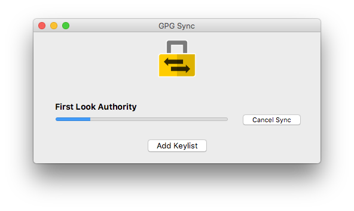

# GPG Sync

GPG Sync is designed to let users always have up-to-date GPG public keys for other members of their organization.

If you're part of an organization that uses GPG internally you might notice that it doesn't scale well. New people join and create new keys and existing people revoke their old keys and transition to new ones. It quickly becomes unwieldy to ensure that everyone has a copy of everyone else's current key, and that old revoked keys get refreshed to prevent users from accidentally using them.

GPG Sync solves this problem by offloading the complexity of GPG to a single trusted person in your organization (referred to here as the "techie"). As a member of an organization, you install GPG Sync on your computer, configure it with a few settings that the techie gives you, and then you forget about it. GPG Sync takes care of everything else.

## Learn More

To learn how GPG Sync works and how to use it, check out the [Wiki](https://github.com/firstlookmedia/gpgsync/wiki).

## Getting GPG Sync

Download Mac OS X binaries from the [Releases](https://github.com/firstlookmedia/gpgsync/releases) page.

Linux users should follow these [simple instructions](https://github.com/firstlookmedia/gpgsync/blob/master/BUILD.md#linux-distributions) to build GPG Sync from source.

A Windows port is being tracked here: [Issue #79](https://github.com/firstlookmedia/gpgsync/issues/79)

## Test Status

